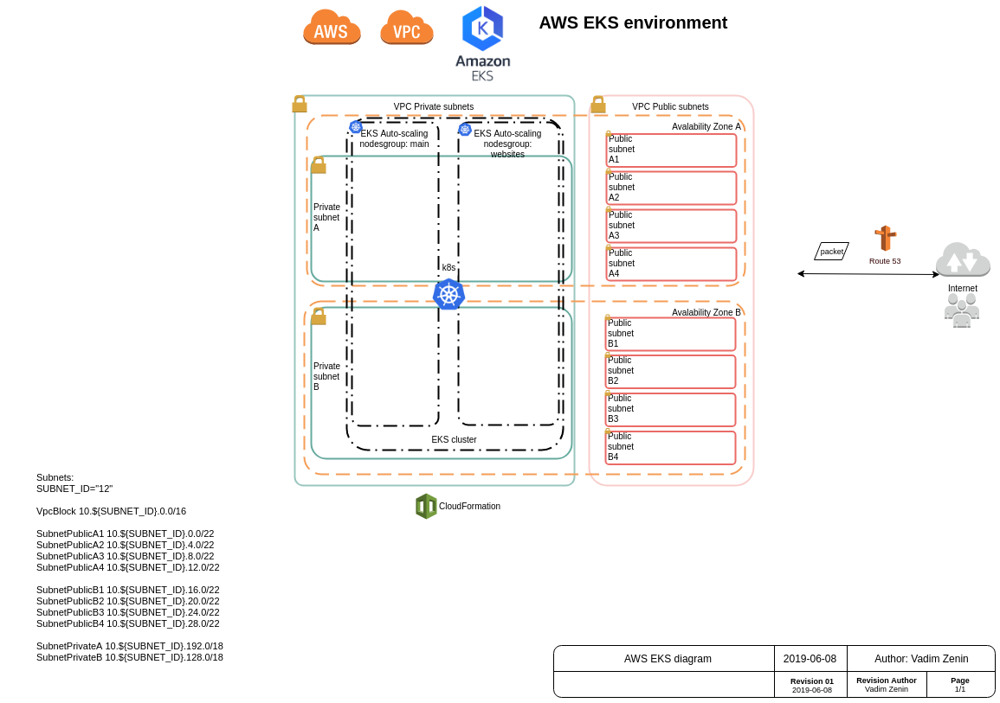

# EKS with 2 nodes groups stacks in private subnets only

VPC: 2 available zones, 2 private and 8 public subnets

Load Balancer is in public subnets.

EKS nodes are in private subnets.

## Environment name

test12


## Diagram



## VPC Subnets:
```bash
SUBNET_ID="12"

VpcBlock 10.${SUBNET_ID}.0.0/16

SubnetPublicA1 10.${SUBNET_ID}.0.0/22
SubnetPublicA2 10.${SUBNET_ID}.4.0/22
SubnetPublicA3 10.${SUBNET_ID}.8.0/22
SubnetPublicA4 10.${SUBNET_ID}.12.0/22

SubnetPublicB1 10.${SUBNET_ID}.16.0/22
SubnetPublicB2 10.${SUBNET_ID}.20.0/22
SubnetPublicB3 10.${SUBNET_ID}.24.0/22
SubnetPublicB4 10.${SUBNET_ID}.28.0/22

SubnetPrivateA 10.${SUBNET_ID}.192.0/18
SubnetPrivateB 10.${SUBNET_ID}.128.0/18
```

## EKS nodes groups

EKS nodes groups:
```
main
websites
```

main is for Kubernetes core service pods.

websites is for our websites pods.

We could scale main and websites groups individually.

## Variables, Configuration

Configuration is in init.sh file.

## Usage

It is as simple as:
```bash
. ~/venv-aws-cli/bin/activate
source ./all.sh 
eksCreateCluster
```

After ~ 28 minutes you will see all Workers as **Ready**:
```bash
$ kubectl get nodes
NAME                                          STATUS     ROLES    AGE   VERSION
ip-10-12-162-237.eu-west-1.compute.internal   Ready      <none>   14m   v1.12.7
ip-10-12-228-122.eu-west-1.compute.internal   Ready      <none>   14m   v1.12.7
ip-10-12-248-78.eu-west-1.compute.internal    NotReady   <none>   19s   v1.12.7
```

## Cleanup

To delete every resources (VPC, Workers, EKS cluster)
```bash
. ./all.sh
eksCleanup
```

I would take ~ 20 minutes to clean up.

Note: AWS keyPair will be kept.
